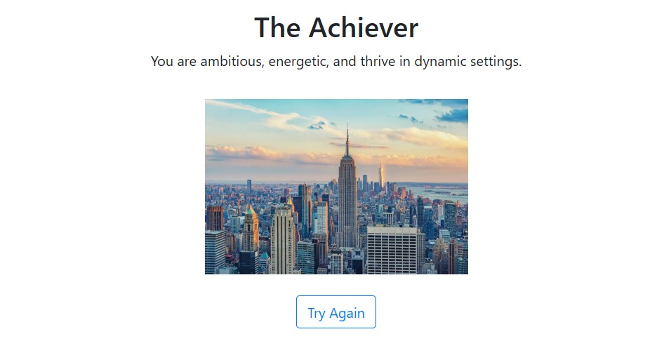

# 🧠 Personalize



A CS50 Final Project — Built with Flask, HTML/CSS/JS, and Python
This application predicts a user’s personality type based on aesthetic image selections instead of text answers, making the quiz experience more engaging and unconventional.

## 🌟 Project Summary

Instead of asking typical questions, users are shown a series of images that align with personality traits (e.g., adventurous vs. reserved).
---

## 🔧 Features

- 🎨 Interactive image-based personality quiz
- 🧪 Simple rules-based model (easy to extend)
- 📱 Mobile-responsive design using Bootstrap
- 🎯 Clean UI and real-time results

---

## 📂 Project Structure

```bash
personalize/
│
├── static/
│   ├── css/
│   │   └── styles.css        # Custom styles
│   └── images/
│       └── *.jpg             # Image options for questions
│
├── templates/
│   ├── index.html
│   └── quiz.html             # Main quiz interface
│   └── result.html           # Results page with prediction
│
├── app.py                    # Flask backend logic
├── personality.py                  # Image-to-personality scoring logic
├── README.md                 # This file
└── requirements.txt          # Dependencies
```

---

## 🚀 Setup Instructions

1. **Clone this repository**:

   ```bash
   git clone https://github.com/thesalmajudah/personalize.git
   cd personality-type-predictor
   ```

2. **Create and activate a virtual environment (optional but recommended)**:

   ```bash
   python3 -m venv venv
   source venv/bin/activate
   ```

3. **Install dependencies**:

   ```bash
   pip install -r requirements.txt
   ```

4. **Run the app**:

   ```bash
   flask run
   ```

5. Open your browser at `http://127.0.0.1:5000/` to start the quiz!

---

## 📊 Technologies Used

- Python 3
- Flask
- Bootstrap 4
- HTML, CSS

---

## 💡 How It Works

Each question offers a set of visually distinct image choices. Each image is mapped to one or more MBTI traits. After the user makes selections, the backend tallies the scores and determines the closest personality match using a rule-based scoring method.

---

## 📦 Requirements

- Flask
- Jinja2
- Python 3.7+

All packages are listed in `requirements.txt`.

---

## 🎥 Video Demo

Watch the video demonstration [here](https://youtu.be/PNGzZdmt7s4).

---


Inspired by CS50's Final Project
